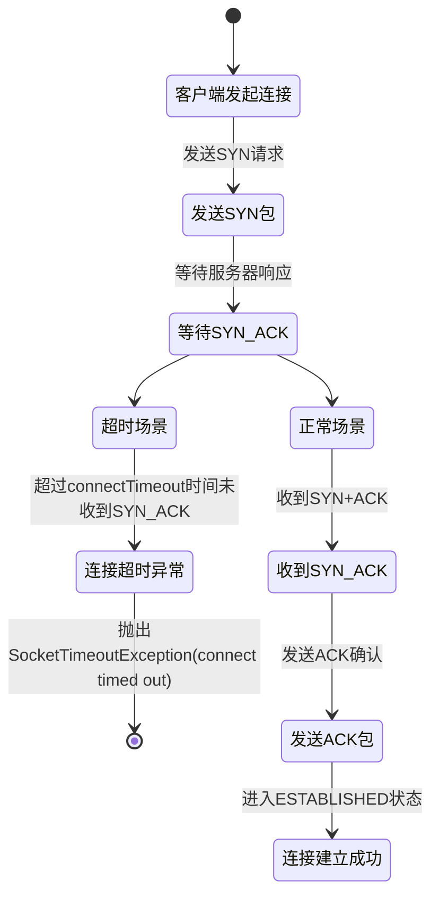
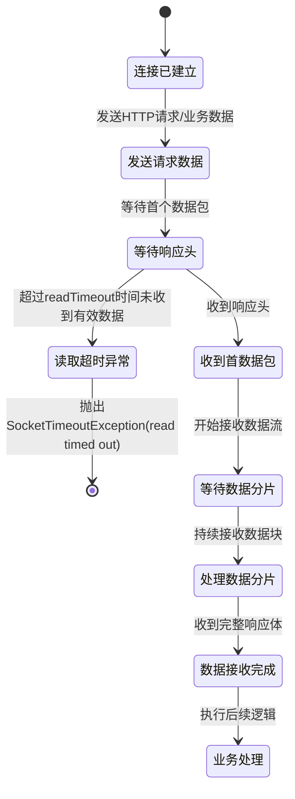
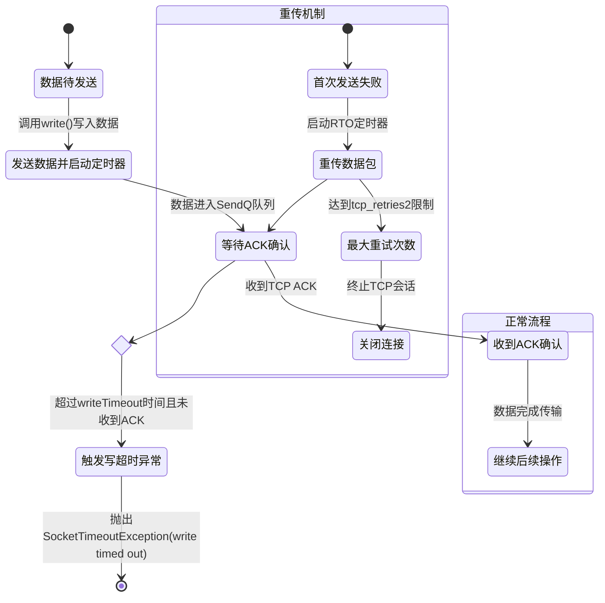

# 理解各种Timeout错误

网络通信中的各种“timed out”错误，诸如 connect timed out、read timed out 和 write timed out，通常与连接的延迟、数据传输的速度和网络状态等因素有关。接下来，我将详细解释这些超时错误的含义、原因和可能的解决方案。

## Connect Timed Out
* 定义：Connect timed out 错误发生在客户端尝试与服务器建立连接时。如果在指定的时间内未能成功建立连接，客户端就会触发超时错误。

* 具体含义：
客户端尝试与目标服务器建立 TCP 连接（即通过三次握手），但在规定的时间内未能完成连接。
这通常发生在连接目标主机不可达或目标主机响应非常慢时。
* 常见原因：
    1. 目标服务器不可达：例如，服务器宕机、目标主机的 IP 地址错误，或者目标端口未开放。
    2. 网络延迟高：客户端与服务器之间的网络延迟过高，导致连接建立超时。
    3. 防火墙或安全设置：客户端或服务器的防火墙可能阻止了连接请求。
    4. DNS 解析失败：域名解析出现问题，导致无法找到目标服务器的 IP 地址。
* 解决方案：
    1. 检查服务器状态：确保目标服务器运行正常，且目标端口已开放。
    2. 验证网络连接：通过 ping 或 traceroute 等工具检查客户端和服务器之间的网络连通性。
    3. 检查防火墙设置：确保没有防火墙或安全组阻止连接。
    4. 验证 DNS 配置：确保域名解析正常，检查是否能成功解析目标服务器的 IP 地址。

## Read Timed Out
* 定义：Read timed out 错误发生在客户端与服务器成功建立连接后，但在等待服务器响应数据时，客户端在规定的时间内没有收到任何数据，从而触发读取超时。

* 具体含义：
客户端已经与服务器建立了连接（即 TCP 三次握手成功），但在请求数据后，客户端等待服务器返回响应时超出了预定的时间限制。
这表明虽然连接是成功的，但服务器在规定时间内没有响应，可能是由于服务器处理请求的时间过长，或者服务器处于过载状态。
* 常见原因：
    1. 服务器处理缓慢：服务器可能在执行某个复杂的操作或查询时耗费了过长的时间，导致超时。
    2. 网络延迟：网络问题或带宽不足导致数据传输变慢，造成超时。
    3. 服务器过载：服务器承载的负载过高，导致处理请求的响应速度减慢，超出客户端的超时时间。
    4. API 限制：某些 API 或 Web 服务可能在请求中有限制，导致需要等待更长时间才能返回数据。
* 解决方案：
    1. 优化服务器性能：检查服务器的负载，优化资源消耗，确保服务器可以及时响应请求。
    2. 增加超时时间：如果是客户端超时设置过短，可以尝试增加超时时间，以允许更多时间来等待服务器响应。
    3. 使用负载均衡：如果服务器负载过高，可以通过负载均衡将请求分发到多个服务器以减少负载。
    4. 优化网络：检查网络质量，确保带宽充足，减少网络延迟。

## Write Timed Out
* 定义：Write timed out 错误发生在客户端向服务器发送数据时，如果在规定的时间内未能成功发送数据或数据写入过程中超时，就会触发写入超时。

* 具体含义：
客户端正在向服务器写入数据，但由于某些原因，数据写入操作无法在规定的时间内完成。
这可能是由于网络拥塞、服务器负载过高，或者服务器的 I/O 处理速度较慢。
* 常见原因：
    1. 网络拥塞：网络带宽不足或网络链路延迟过高，导致数据传输速度过慢，无法在规定时间内完成写入。
    2. 服务器负载过高：服务器的磁盘 I/O 或 CPU 资源可能处于高负载状态，导致写操作缓慢。
    3. 大文件上传：客户端尝试上传的文件较大，导致数据写入操作超时。
    4. TCP 拥塞控制：TCP 协议本身有一定的流量控制和拥塞控制机制，可能会导致写操作被延迟，最终超时。
* 解决方案：
    1.  检查网络质量：使用工具（如 ping、iperf）检查网络延迟和带宽，确保网络链路畅通。
    2. 优化服务器资源：如果是服务器负载过高，考虑优化服务器配置、增加硬件资源，或者优化数据处理逻辑。
    3. 分块传输：对于大文件上传，考虑使用分块上传等技术，避免一次性传输大数据造成超时。
    4. 增加客户端超时时间：如果客户端超时时间设置过短，可以增加超时时间，给予服务器更多的时间来完成写操作。

## 总结
* Connect Timed Out：连接超时，客户端无法在规定时间内建立与服务器的连接，通常是由于网络问题、目标服务器不可达或防火墙设置导致。
* Read Timed Out：读取超时，客户端与服务器连接成功，但在规定时间内未收到服务器响应，可能是服务器处理过慢、网络延迟或服务器负载过高等原因导致。
* Write Timed Out：写入超时，客户端尝试向服务器发送数据时，未能在规定时间内完成数据发送，通常是由于网络拥塞、服务器负载过高或大文件传输造成的。

对比三种timeout：

|                | ConnectTimeout       | ReadTimeout     | WriteTimeout           |
|--------------------|-------------------------------------------------------|----------------------------------------------------|-----------------------------------------------------|
| ​**定义**​           | 建立TCP连接的最大等待时间（含DNS解析、三次握手）       | 建立连接后等待服务器响应数据的最大时间              | 向服务器发送数据的最大等待时间                       |
| ​**触发阶段**​       | TCP三次握手阶段（SYN-SYN_ACK交换）                    | 数据传输阶段（ESTABLISHED状态）                    | 数据发送阶段（SendQ队列传输）                        |
| ​**典型异常**​       | `SocketTimeoutException: connect timed out`          | `SocketTimeoutException: read timed out`          | `SocketTimeoutException: write timed out`           |
| ​**典型场景**​       | 服务器未启动、防火墙拦截、网络路由故障                | 服务器处理延迟、大文件下载断流、网络波动           | 大文件上传卡顿、发送缓冲区满、网络中断               |
| ​**配置方法**​       | Java：`setConnectTimeout()` HTTP库：`connectTimeout` | Java：`setReadTimeout()` HTTP库：`readTimeout`     | Netty：`WriteTimeoutHandler` Go：`SetWriteDeadline` |
| ​**默认值**​         | 无限等待（部分框架默认2-5秒）                          | 无限等待（部分框架默认30-60秒）                     | 无限等待（部分框架默认30秒）                         |
| ​**协议层关联**​     | 应用层设置覆盖TCP内核参数`tcp_syn_retries`        | 应用层设置覆盖TCP内核参数`tcp_retries2`      | 应用层与TCP重传机制协同（RTO动态计算）      |
 

在遇到这些超时错误时，通常需要根据具体情况排查网络连接、服务器负载、配置参数等因素，以找到根本原因并解决问题。

---

> 作者:   
> URL: http://localhost:1313/posts/all-kinds-of-timeout/  

